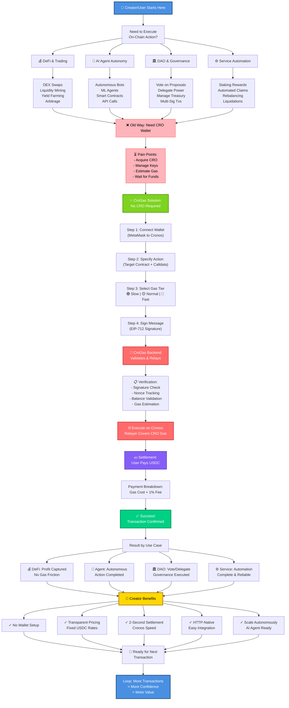

```mermaid
graph TD
    A["🎯 Creator/User Starts Here"] --> B["Need to Execute<br/>On-Chain Action?"]
    
    B --> C1["💰 DeFi & Trading"]
    B --> C2["🤖 AI Agent Autonomy"]
    B --> C3["🏛️ DAO & Governance"]
    B --> C4["⚙️ Service Automation"]
    
    C1 --> D1["DEX Swaps<br/>Liquidity Mining<br/>Yield Farming<br/>Arbitrage"]
    C2 --> D2["Autonomous Bots<br/>ML Agents<br/>Smart Contracts<br/>API Calls"]
    C3 --> D3["Vote on Proposals<br/>Delegate Power<br/>Manage Treasury<br/>Multi-Sig Txs"]
    C4 --> D4["Staking Rewards<br/>Automated Claims<br/>Rebalancing<br/>Liquidations"]
    
    D1 --> E["❌ Old Way: Need CRO Wallet"]
    D2 --> E
    D3 --> E
    D4 --> E
    
    E --> F["⏳ Pain Points:<br/>- Acquire CRO<br/>- Manage Keys<br/>- Estimate Gas<br/>- Wait for Funds"]
    
    F --> G["✨ CroGas Solution:<br/>No CRO Required"]
    
    G --> H["Step 1: Connect Wallet<br/>(MetaMask to Cronos)"]
    H --> I["Step 2: Specify Action<br/>(Target Contract + Calldata)"]
    I --> J["Step 3: Select Gas Tier<br/>🟢 Slow | 🟡 Normal | 🔴 Fast"]
    J --> K["Step 4: Sign Message<br/>(EIP-712 Signature)"]
    
    K --> L["🔄 CroGas Backend<br/>Validates & Relays"]
    L --> M["📋 Verification:<br/>- Signature Check<br/>- Nonce Tracking<br/>- Balance Validation<br/>- Gas Estimation"]
    
    M --> N["⛓️ Execute on Cronos<br/>Relayer Covers CRO Gas"]
    
    N --> O["💵 Settlement:<br/>User Pays USDC"]
    O --> P["Payment Breakdown:<br/>Gas Cost + 1% Fee"]
    
    P --> Q["✅ Success!<br/>Transaction Confirmed"]
    
    Q --> R["Result by Use Case"]
    
    R --> R1["💰 DeFi: Profit Captured<br/>No Gas Friction"]
    R --> R2["🤖 Agent: Autonomous<br/>Action Completed"]
    R --> R3["🏛️ DAO: Vote/Delegate<br/>Governance Executed"]
    R --> R4["⚙️ Service: Automation<br/>Complete & Reliable"]
    
    R1 --> S["🎉 Creator Benefits"]
    R2 --> S
    R3 --> S
    R4 --> S
    
    S --> S1["✓ No Wallet Setup"]
    S --> S2["✓ Transparent Pricing<br/>Fixed USDC Rates"]
    S --> S3["✓ 2-Second Settlement<br/>Cronos Speed"]
    S --> S4["✓ HTTP-Native<br/>Easy Integration"]
    S --> S5["✓ Scale Autonomously<br/>AI Agent Ready"]
    
    S1 --> T["🚀 Ready for Next<br/>Transaction"]
    S2 --> T
    S3 --> T
    S4 --> T
    S5 --> T
    
    T --> U["Loop: More Transactions<br/>= More Confidence<br/>= More Value"]
    
    style A fill:#4A90E2,stroke:#2E5C8A,color:#fff,stroke-width:3px
    style G fill:#7ED321,stroke:#5FA618,color:#fff,stroke-width:3px
    style L fill:#FF6B6B,stroke:#C92A2A,color:#fff,stroke-width:2px
    style N fill:#FF6B6B,stroke:#C92A2A,color:#fff,stroke-width:2px
    style O fill:#845EF7,stroke:#5F3DC4,color:#fff,stroke-width:2px
    style Q fill:#00D084,stroke:#009B5F,color:#fff,stroke-width:3px
    style S fill:#FFD700,stroke:#B8860B,color:#000,stroke-width:3px
    style U fill:#4A90E2,stroke:#2E5C8A,color:#fff,stroke-width:3px
    
    style E fill:#FFB3BA,stroke:#E74C3C,color:#000
    style F fill:#FFB3BA,stroke:#E74C3C,color:#000
```
