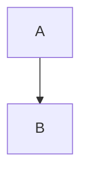

# 🚀 Quick Start: GitHub Documentation Setup

**TL;DR**: Copy 13 files to your repo root, commit, push. Done. GitHub renders Mermaid diagrams automatically.

---

## ⚡ 5-Minute Setup

### 1. Copy Files to Repo Root
```bash
# Navigate to your CroGas repository
cd ~/path/to/CroGas

# Verify you're in the right place
pwd  # Should show: .../CroGas
ls   # Should show: crogas_frontend, crogas_backend, package.json, etc.

# Make sure all 13 .md files are in this directory (not in a subdirectory)
# Files to have in root:
# - README.md
# - API.md
# - ARCHITECTURE.md
# - CONTRIBUTING.md
# - DEPLOYMENT.md
# - SECURITY.md
# - TROUBLESHOOTING.md
# - DIAGRAMS_INDEX.md
# - CROGAS_FLOWCHART.md
# - INVESTOR_OVERVIEW.md
# - TECHNICAL_FLOW.md
# - DOCUMENTATION_SUMMARY.md
# - GITHUB_QUICK_START.md
```

### 2. Add & Commit
```bash
git add *.md
git status  # Verify all 13 files show as "new file"
git commit -m "docs: add complete documentation suite"
```

### 3. Push to GitHub
```bash
git push origin main
```

### 4. Verify on GitHub
Go to: `https://github.com/KingRaver/CroGas`
- [ ] All 13 `.md` files appear in root directory
- [ ] Mermaid diagrams render in Markdown preview
- [ ] README displays as main landing page

**✅ Done!** Your documentation is live.

---

## 📋 What Each File Does

| File | Shows On GitHub | Used By |
|------|-----------------|---------|
| **README.md** | Main repo page | Everyone (investors, devs, users) |
| **API.md** | Click from README | Developers building integrations |
| **ARCHITECTURE.md** | Click from README | Technical team, architects |
| **CONTRIBUTING.md** | Auto-linked to PRs | Contributors |
| **DEPLOYMENT.md** | Click from README | DevOps, operations team |
| **SECURITY.md** | Click from README | Security auditors, investors |
| **TROUBLESHOOTING.md** | Click from README | Users with issues |
| **CROGAS_FLOWCHART.md** | Mermaid diagram | Visualize creator workflow |
| **INVESTOR_OVERVIEW.md** | Mermaid diagram | Visualize business model |
| **TECHNICAL_FLOW.md** | Mermaid diagram | Visualize transaction flow |
| **DIAGRAMS_INDEX.md** | Guide to diagrams | Navigation hub |
| **DOCUMENTATION_SUMMARY.md** | Full reference | Documentation metadata |
| **GITHUB_QUICK_START.md** | This file | Setup instructions |

---

## 🎯 For Different Audiences

### **Investors & Judges**
1. Go to repo
2. Click [INVESTOR_OVERVIEW.md](INVESTOR_OVERVIEW.md)
3. See Mermaid business model diagram
4. Read [README.md](README.md) for details

### **Developers**
1. Go to repo → README.md
2. Click [API.md](API.md) for endpoints
3. Click [ARCHITECTURE.md](ARCHITECTURE.md) for system design
4. Click [CONTRIBUTING.md](CONTRIBUTING.md) to help out

### **Users**
1. Go to repo → README.md
2. Click [CROGAS_FLOWCHART.md](CROGAS_FLOWCHART.md) to see how it works
3. Click [TROUBLESHOOTING.md](TROUBLESHOOTING.md) if stuck

---

## 🔍 Verify Everything Works

### Check Mermaid Diagrams Render
```bash
# After pushing to GitHub, visit:
https://github.com/KingRaver/CroGas/blob/main/CROGAS_FLOWCHART.md
# You should see a flowchart diagram (not raw code)

https://github.com/KingRaver/CroGas/blob/main/INVESTOR_OVERVIEW.md
# You should see a business model diagram

https://github.com/KingRaver/CroGas/blob/main/TECHNICAL_FLOW.md
# You should see a sequence diagram
```

### Check All Links Work
```bash
# GitHub auto-validates links
# Go to each file and click around
# All relative links like [CONTRIBUTING.md](CONTRIBUTING.md) should work
```

### Check README is Default Landing Page
```bash
# Visit: https://github.com/KingRaver/CroGas
# You should see README.md rendered as main page (not file listing)
```

---

## 📝 Update & Maintain Docs

### Make Changes
```bash
# Edit any .md file directly on GitHub, or locally:
nano README.md  # or your editor

# Add/remove/modify content
# GitHub auto-renders changes

# Commit locally
git add README.md
git commit -m "docs: update README with new section"
git push origin main

# Change appears immediately on GitHub
```

### GitHub's Automatic Features
Once files are in root, GitHub automatically:
- ✅ Renders Markdown
- ✅ Renders Mermaid diagrams
- ✅ Creates searchable index
- ✅ Tracks version history
- ✅ Suggests improvements
- ✅ Allows code review of edits

---

## 🎨 The Diagrams Will Look Like

### CROGAS_FLOWCHART.md
Shows: Creator needs → CroGas solves → Success outcomes
- Colorful flow chart
- 4 use case branches
- Step-by-step execution
- Benefits highlighted

### INVESTOR_OVERVIEW.md
Shows: Market → Problem → Solution → Revenue
- Business model flow
- Color-coded sections
- Clear value proposition
- Revenue path

### TECHNICAL_FLOW.md
Shows: User → Frontend → Backend → Blockchain → Success/Error
- Sequence diagram
- All steps numbered
- Security checks marked
- Error paths shown

---

## ⚠️ Common Issues

### Diagrams don't render
**Solution**: Make sure code is in ` ```mermaid ` blocks (with backticks)
```
✅ Correct:


❌ Wrong:
```
mermaid
graph TD
  A --> B
```
```

### Links don't work
**Solution**: Use relative paths, not absolute URLs
```
✅ Correct:
[Click here](CONTRIBUTING.md)

❌ Wrong:
[Click here](https://github.com/KingRaver/CroGas/blob/main/CONTRIBUTING.md)
```

### Can't find files
**Solution**: Ensure `.md` files are in repo root, not in subdirectory
```bash
# Good structure:
CroGas/
├── README.md          ← root level
├── API.md             ← root level
├── crogas_frontend/
└── crogas_backend/

# Bad structure:
CroGas/
├── docs/
│   ├── README.md      ← NOT HERE
│   └── API.md         ← NOT HERE
└── crogas_frontend/
```

---

## 🚀 Share Your Documentation

Once live on GitHub:

### In Pitch Deck
```
"See our complete documentation:
github.com/KingRaver/CroGas/blob/main/INVESTOR_OVERVIEW.md"
```

### In Email
```
"Check out our documentation:
- User guide: crogas/blob/main/CROGAS_FLOWCHART.md
- API reference: crogas/blob/main/API.md
- Business model: crogas/blob/main/INVESTOR_OVERVIEW.md"
```

### In Discord/Twitter
```
"Comprehensive docs now live! 📚
🔗 github.com/KingRaver/CroGas
👉 Start with INVESTOR_OVERVIEW.md
💻 Devs: Check API.md
🎯 Users: See CROGAS_FLOWCHART.md"
```

---

## 📊 Monitor Documentation Usage

GitHub automatically tracks:
- **Traffic**: How many views per page
- **Referrers**: Where people come from
- **Popular pages**: Which docs are used most

Access via: Repository → Insights → Traffic

This helps you know:
- Which sections need improvement
- Which diagrams are most useful
- What users actually look for

---

## ✅ Final Checklist

Before sharing your docs with investors:

- [ ] All 13 `.md` files in repo root
- [ ] Committed to GitHub main branch
- [ ] README displays on repo landing page
- [ ] All Mermaid diagrams render (not show code)
- [ ] All links work (test each one)
- [ ] No typos or grammar errors
- [ ] No real private keys exposed
- [ ] No placeholder emails/contacts (update if needed)
- [ ] File names match exactly in links
- [ ] README links to other docs

---

## 🎓 Pro Tips

### Tip 1: Pin Important Docs
In your README, add at the top:
```markdown
## 📚 Start Here
- **[For Investors](INVESTOR_OVERVIEW.md)** → Business model diagram
- **[For Users](CROGAS_FLOWCHART.md)** → How to use CroGas
- **[For Developers](API.md)** → API reference
```

### Tip 2: Enable GitHub Pages (Optional)
For more polished documentation site:
1. Repo Settings → Pages
2. Set Source: main branch /root
3. GitHub auto-builds searchable site
4. Access via: `username.github.io/CroGas`

### Tip 3: Create Issue Templates
Add `.github/ISSUE_TEMPLATE/bug_report.md` with:
```
## Bug Report
### Description
[Your issue here]

### Steps to Reproduce
1. ...

### See Also
See [TROUBLESHOOTING.md](TROUBLESHOOTING.md)
```

### Tip 4: Link in Code
Add comments referencing docs:
```typescript
// See ARCHITECTURE.md for data flow explanation
// See API.md for endpoint reference
// See SECURITY.md for encryption details
```

### Tip 5: Add to Package.json Scripts
Make it easy to find docs:
```json
{
  "scripts": {
    "docs": "echo 'See README.md for full documentation'",
    "docs:api": "echo 'API reference: API.md'",
    "docs:arch": "echo 'Architecture: ARCHITECTURE.md'"
  }
}
```

### Tip 6: Create .github Directory Structure
Enhance GitHub integration:
```bash
mkdir -p .github/ISSUE_TEMPLATE
mkdir -p .github/PULL_REQUEST_TEMPLATE

# Add issue template with documentation links
cat > .github/ISSUE_TEMPLATE/bug_report.md << 'EOF'
---
name: Bug report
about: Create a report to help us improve
---

## Description
<!-- Describe the issue -->

## Steps to Reproduce
1. ...

## Expected Behavior
<!-- What should happen -->

## Actual Behavior
<!-- What actually happens -->

## Environment
- OS: 
- Browser: 
- Node: 

## Related Documentation
- [Troubleshooting Guide](../../TROUBLESHOOTING.md)
- [Architecture](../../ARCHITECTURE.md)
EOF
```

---

## 💬 Get Feedback

Add to your README:
```markdown
## Documentation Feedback?
Found a typo or unclear explanation?
- [Open an issue](https://github.com/KingRaver/CroGas/issues)
- [Start a discussion](https://github.com/KingRaver/CroGas/discussions)
- [Edit on GitHub](https://github.com/KingRaver/CroGas/edit/main/README.md)
- [See all docs](DIAGRAMS_INDEX.md)
```

This encourages community contributions and improves docs over time.

---

## 🎉 You're Done!

Your professional, investor-approved documentation is now live on GitHub with:

✅ **Complete project overview** (README)  
✅ **API reference** for integration  
✅ **Architecture guide** for credibility  
✅ **Contributing guide** for open source  
✅ **Security policy** for trust  
✅ **Troubleshooting** for support  
✅ **3 Professional Mermaid diagrams** for all audiences  
✅ **Setup guide** for quick onboarding  

**Render automatically. Zero maintenance. GitHub handles everything.**

---

## 📞 Next Steps

1. **Push to GitHub** → `git push origin main`
2. **Test on GitHub** → Visit repo, check all links
3. **Share with investors** → Send INVESTOR_OVERVIEW.md link
4. **Gather feedback** → Monitor GitHub Insights
5. **Keep updated** → Edit .md files as project evolves

### Specific Timeline

**Day 1: Push & Verify**
```bash
git add *.md
git commit -m "docs: complete documentation suite"
git push origin main
# Visit repo and verify all files render correctly
```

**Day 2: Share with Stakeholders**
- Email investors link to INVESTOR_OVERVIEW.md
- Post on Twitter/Discord
- Share in grant applications

**Week 1: Monitor & Gather Feedback**
- Check GitHub Insights → Traffic
- Watch for GitHub Issues about docs
- Monitor Discussions

**Week 2: Iterate**
- Fix any typos/unclear sections
- Add FAQ based on questions
- Update metrics

---

## 📊 Documentation Metrics to Track

Once live, monitor these metrics:

| Metric | How to Check | What It Means |
|--------|--------------|---------------|
| Page Views | Insights → Traffic | Which docs are most valuable? |
| Referrers | Insights → Traffic | Where do people come from? |
| Time on Page | GitHub Analytics | Are docs clear or confusing? |
| GitHub Issues | Issues → Filter by label | Is something unclear? |
| Discussions | Discussions tab | What are users asking? |
| Forks | Right side of repo | Are people copying your setup? |
| Stars | Right side of repo | Community interest level |

---

## 🔄 Update Workflow

### Regular Maintenance (Monthly)
```bash
# Check for broken links
# Review docs against current code
# Fix typos and outdated info
# Update version numbers if changed

git add updated_files.md
git commit -m "docs: monthly review and updates"
git push origin main
```

### Major Updates (Quarterly)
```bash
# Add new features to API.md
# Update ROADMAP section in README
# Add new diagrams if architecture changes
# Update deployment procedures

git add *.md
git commit -m "docs: Q1 2026 documentation update"
git push origin main
```

### Breaking Changes (As Needed)
```bash
# Create migration guide
# Update all affected documentation
# Announce in CHANGELOG
# Consider security implications

git add -A
git commit -m "docs: breaking change - API v2 migration guide"
git push origin main
```

---

## 🛡️ Documentation Quality Checklist

Use this when making changes:

### Content Quality
- [ ] All code examples are syntactically correct
- [ ] All links are tested and working
- [ ] No outdated information
- [ ] Examples match current codebase
- [ ] Grammar and spelling checked

### Technical Accuracy
- [ ] API endpoints match actual code
- [ ] Architecture diagrams reflect reality
- [ ] Security recommendations are current
- [ ] Deployment steps are tested
- [ ] Database/environment info is correct

### Clarity & Completeness
- [ ] Jargon explained or linked
- [ ] Examples for every major feature
- [ ] Troubleshooting covers common issues
- [ ] Navigation between docs is clear
- [ ] TOC/headers are logical

### GitHub Standards
- [ ] Markdown is properly formatted
- [ ] Mermaid diagrams render without errors
- [ ] All images have alt text
- [ ] Code blocks have language identifiers
- [ ] Relative links use correct paths

---

## 🎓 Git Best Practices

When updating documentation:

```bash
# Create a feature branch for major changes
git checkout -b docs/major-update
# Make changes
git add *.md
git commit -m "docs: major update - add new sections"
git push origin docs/major-update
# Create PR for review
# Merge to main after approval

# For small fixes, can commit directly
git add README.md
git commit -m "docs: fix typo in README"
git push origin main
```

---

**That's it!** 🚀

Your documentation is production-ready and GitHub-approved.

---

**Last Updated**: January 5, 2026  
**Total Files**: 13  
**Total Content**: ~50,000 words  
**Setup Time**: ~5 minutes  
**Maintenance**: Auto-rendered by GitHub (no servers needed)  
**Version**: 1.0.0 Complete Suite
