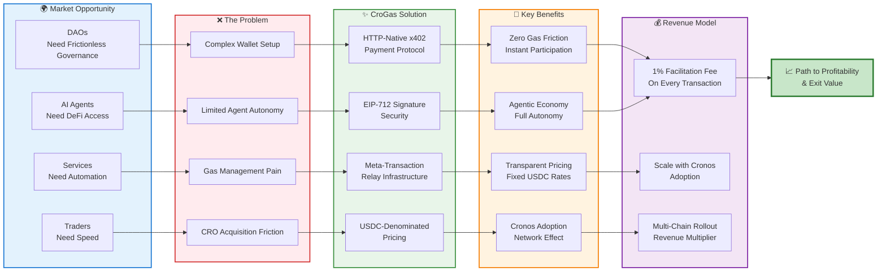

```mermaid
graph LR
    subgraph market["🌍 Market Opportunity"]
        M1["AI Agents<br/>Need DeFi Access"] 
        M2["DAOs<br/>Need Frictionless Governance"]
        M3["Services<br/>Need Automation"]
        M4["Traders<br/>Need Speed"]
    end
    
    subgraph problem["❌ The Problem"]
        P1["Complex Wallet Setup"]
        P2["Gas Management Pain"]
        P3["CRO Acquisition Friction"]
        P4["Limited Agent Autonomy"]
    end
    
    subgraph crogas["✨ CroGas Solution"]
        S1["HTTP-Native x402<br/>Payment Protocol"]
        S2["Meta-Transaction<br/>Relay Infrastructure"]
        S3["USDC-Denominated<br/>Pricing"]
        S4["EIP-712 Signature<br/>Security"]
    end
    
    subgraph benefits["🎯 Key Benefits"]
        B1["Zero Gas Friction<br/>Instant Participation"]
        B2["Transparent Pricing<br/>Fixed USDC Rates"]
        B3["Cronos Adoption<br/>Network Effect"]
        B4["Agentic Economy<br/>Full Autonomy"]
    end
    
    subgraph revenue["💰 Revenue Model"]
        R1["1% Facilitation Fee<br/>On Every Transaction"]
        R2["Scale with Cronos<br/>Adoption"]
        R3["Multi-Chain Rollout<br/>Revenue Multiplier"]
    end
    
    M1 --> P4
    M2 --> P1
    M3 --> P2
    M4 --> P3
    
    P1 --> S1
    P2 --> S2
    P3 --> S3
    P4 --> S4
    
    S1 --> B1
    S2 --> B2
    S3 --> B3
    S4 --> B4
    
    B1 --> R1
    B2 --> R2
    B3 --> R3
    B4 --> R1
    
    R1 --> exit["📈 Path to Profitability<br/>& Exit Value"]
    
    style market fill:#E3F2FD,stroke:#1976D2,stroke-width:2px
    style problem fill:#FFEBEE,stroke:#D32F2F,stroke-width:2px
    style crogas fill:#E8F5E9,stroke:#388E3C,stroke-width:2px
    style benefits fill:#FFF3E0,stroke:#F57C00,stroke-width:2px
    style revenue fill:#F3E5F5,stroke:#7B1FA2,stroke-width:2px
    style exit fill:#C8E6C9,stroke:#2E7D32,stroke-width:3px
```
