# Technical Flow: Complete Transaction Sequence

This document describes the complete technical flow of how CroGas processes a user transaction from start to finish.

---

## 🔄 Transaction Flow Overview

```mermaid
sequenceDiagram
    participant User as 👤 Creator
    participant Frontend as 🖥️ Frontend
    participant Backend as 🔄 Backend
    participant Blockchain as ⛓️ Cronos

    User->>Frontend: 1. Connect Wallet
    Frontend->>Frontend: Detect MetaMask
    Frontend-->>User: Connected ✅

    User->>Frontend: 2. Enter Contract Details
    Frontend->>Frontend: Validate Inputs
    Frontend-->>User: Ready

    User->>Frontend: 3. Sign EIP-712 Message
    Frontend->>Frontend: Create TypedData
    Frontend-->>User: Sign in Wallet
    User-->>Frontend: Signature ✅

    Frontend->>Backend: 4. POST /x402/facilitate
    Backend->>Backend: Verify Signature
    Backend->>Backend: Check Nonce
    Backend->>Backend: Validate Request
    Backend->>Backend: Estimate Gas
    Backend->>Backend: Calculate USDC Fee
    Backend->>Backend: Check USDC Balance
    Backend->>Backend: Check CRO Balance

    alt ✅ All Checks Pass
        Backend->>Blockchain: Execute Transaction
        Blockchain->>Blockchain: Relay Contract
        Blockchain->>Blockchain: Execute Calldata
        Blockchain-->>Backend: Success
        Backend->>Blockchain: Transfer USDC
        Blockchain-->>Backend: Payment Confirmed
        Backend-->>Frontend: Return Success
        Frontend-->>User: 🎉 Confirmed
    else ❌ Signature Invalid
        Backend-->>Frontend: Error 401
        Frontend-->>User: Invalid Signature
    else ❌ Insufficient Balance
        Backend-->>Frontend: Error 402
        Frontend-->>User: Insufficient USDC
    else ❌ Rate Limited
        Backend-->>Frontend: Error 429
        Frontend-->>User: Try Again Later
    else ❌ Relay Failed
        Backend-->>Frontend: Error 500
        Frontend-->>User: Transaction Failed
    end

    Note over Backend,Blockchain: Security Checkpoints<br/>✓ EIP-712 Verified<br/>✓ Nonce Protected<br/>✓ Balance Checked<br/>✓ Keys Encrypted
```



---

## 📋 Detailed Step Breakdown

### **Step 1: Wallet Connection**

**What happens:**
1. User opens CroGas frontend (Next.js app)
2. Frontend detects MetaMask wallet extension
3. Frontend requests wallet connection to Cronos network
4. User approves connection in MetaMask popup
5. Frontend displays connected wallet address

**Code Flow:**
```typescript
// Frontend/utils/wallet.ts
const connectWallet = async () => {
  if (!window.ethereum) throw new Error("MetaMask not installed");
  
  const accounts = await window.ethereum.request({
    method: "eth_requestAccounts"
  });
  
  // Switch to Cronos network
  await window.ethereum.request({
    method: "wallet_switchEthereumChain",
    params: [{ chainId: "0x19" }] // Cronos testnet
  });
  
  return accounts[0];
};
```

**Error Handling:**
- If MetaMask not installed → "Install MetaMask" message
- If network not Cronos → Prompt to switch network
- If user rejects → Retry option

---

### **Step 2: Specify Transaction Details**

**What the user provides:**
- **Target Contract**: Address of smart contract to call
- **Function Call Data**: Encoded function call (calldata)
- **Gas Tier**: Slow / Normal / Fast (affects fee)

**Frontend Validation:**
```typescript
// Frontend/components/TransactionForm.tsx
const validateInputs = (formData) => {
  // Validate contract address format (0x...)
  if (!ethers.utils.isAddress(formData.targetContract)) {
    throw new Error("Invalid contract address");
  }
  
  // Validate calldata is hex string
  if (!/^0x[0-9a-f]*$/i.test(formData.calldata)) {
    throw new Error("Invalid calldata format");
  }
  
  // Validate gas tier
  const validTiers = ["slow", "normal", "fast"];
  if (!validTiers.includes(formData.gasTier)) {
    throw new Error("Invalid gas tier");
  }
  
  return true;
};
```

**Error Handling:**
- Invalid address → Show address format helper
- Invalid calldata → Show hex format requirement
- Invalid gas tier → Show radio button options

---

### **Step 3: Sign EIP-712 Message**

**What is EIP-712?**
EIP-712 is a standard for cryptographically signing structured data (not just plain text). This allows:
- User to see exactly what they're signing in MetaMask
- Backend to verify signature without being on-chain
- Protection against signature replay attacks

**Frontend Creates TypedData:**
```typescript
// Frontend/utils/eip712.ts
const createEIP712Message = (userAddress, targetContract, calldata, gasTier, nonce) => {
  return {
    types: {
      EIP712Domain: [
        { name: "name", type: "string" },
        { name: "version", type: "string" },
        { name: "chainId", type: "uint256" },
        { name: "verifyingContract", type: "address" }
      ],
      FacilitateRequest: [
        { name: "targetContract", type: "address" },
        { name: "calldata", type: "bytes" },
        { name: "gasTier", type: "string" },
        { name: "nonce", type: "uint256" },
        { name: "deadline", type: "uint256" }
      ]
    },
    primaryType: "FacilitateRequest",
    domain: {
      name: "CroGas",
      version: "1",
      chainId: 338, // Cronos testnet
      verifyingContract: CROGAS_RELAY_CONTRACT
    },
    message: {
      targetContract,
      calldata,
      gasTier,
      nonce,
      deadline: Math.floor(Date.now() / 1000) + 3600 // 1 hour expiry
    }
  };
};
```

**User Action:**
1. Frontend requests signature via `eth_signTypedData_v4`
2. MetaMask displays what will be signed
3. User reviews and clicks "Sign" button
4. MetaMask returns signature (65 bytes: r, s, v)

**Error Handling:**
- User cancels signature → Retry option
- MetaMask not responding → Timeout error
- Signature expired → Request new signature

---

### **Step 4: Send to Backend**

**Frontend sends HTTP POST request:**
```bash
POST /x402/facilitate HTTP/1.1
Content-Type: application/json

{
  "userAddress": "0x742d35Cc6634C0532925a3b844Bc9e7595f42bE4",
  "targetContract": "0x1234567890123456789012345678901234567890",
  "calldata": "0xa9059cbb000000000000000000000000...",
  "gasTier": "normal",
  "signature": "0x...", // 65 byte signature
  "nonce": 0,
  "deadline": 1704467400
}
```

---

## 🔐 Backend Validation & Security

### **Backend Receives Request**

The backend immediately validates everything before proceeding:

```typescript
// Backend/routes/x402.ts
app.post("/x402/facilitate", async (req, res) => {
  const { userAddress, targetContract, calldata, gasTier, signature, nonce, deadline } = req.body;
  
  // === VALIDATION LAYER ===
  
  // 1️⃣ SIGNATURE VERIFICATION
  const recoveredAddress = verifyEIP712Signature(
    signature,
    userAddress,
    targetContract,
    calldata,
    gasTier,
    nonce,
    deadline
  );
  
  if (recoveredAddress !== userAddress) {
    return res.status(401).json({ error: "Invalid signature" });
  }
  
  // 2️⃣ NONCE CHECK (prevent replay attacks)
  const lastNonce = await db.getUserLastNonce(userAddress);
  if (nonce !== lastNonce + 1) {
    return res.status(400).json({ error: "Invalid nonce. Expected " + (lastNonce + 1) });
  }
  
  // 3️⃣ REQUEST VALIDATION (Zod schema)
  const schema = z.object({
    userAddress: z.string().regex(/^0x[0-9a-f]{40}$/i),
    targetContract: z.string().regex(/^0x[0-9a-f]{40}$/i),
    calldata: z.string().regex(/^0x[0-9a-f]*$/i),
    gasTier: z.enum(["slow", "normal", "fast"]),
    signature: z.string().regex(/^0x[0-9a-f]{130}$/i), // 65 bytes = 130 hex chars
    nonce: z.number().int().nonnegative(),
    deadline: z.number().int().positive()
  });
  
  const validation = schema.safeParse(req.body);
  if (!validation.success) {
    return res.status(400).json({ error: "Invalid request format", details: validation.error });
  }
  
  // 4️⃣ GAS ESTIMATION
  const estimatedGas = await estimateGas(targetContract, calldata);
  const gasPrice = await getGasPrice(gasTier); // slow/normal/fast
  const gasCostCRO = estimatedGas * gasPrice;
  
  // 5️⃣ USDC FEE CALCULATION
  const usdcFee = await convertCROtoUSDC(gasCostCRO);
  const totalUSDCCharge = usdcFee + (usdcFee * 0.01); // Add 1% protocol fee
  
  // 6️⃣ CHECK USER USDC BALANCE
  const userUSDBBalance = await getUSDCBalance(userAddress);
  if (userUSDBBalance < totalUSDCCharge) {
    return res.status(402).json({
      error: "Insufficient USDC balance",
      required: totalUSDCCharge,
      available: userUSDCBalance
    });
  }
  
  // 7️⃣ CHECK RELAYER CRO BALANCE
  const relayerCROBalance = await getCROBalance(RELAYER_ADDRESS);
  const gasInCRO = gasCostCRO * 1.1; // Add 10% buffer
  if (relayerCROBalance < gasInCRO) {
    return res.status(503).json({ error: "Relayer CRO depleted. Try again later." });
  }
  
  // === ALL CHECKS PASSED ===
  // Proceed to execution...
});
```

---

## ⛓️ Blockchain Execution

### **Backend Calls Relay Contract**

If all validation passes, the backend executes the transaction:

```typescript
// Backend/services/relay.ts
const executeTransaction = async (userAddress, targetContract, calldata) => {
  // Get relayer's private key (encrypted in environment)
  const relayerPrivateKey = decryptPrivateKey(process.env.RELAYER_KEY_ENCRYPTED);
  const relayerWallet = new ethers.Wallet(relayerPrivateKey, provider);
  
  // Create relay contract instance
  const relayContract = new ethers.Contract(
    RELAY_CONTRACT_ADDRESS,
    RELAY_ABI,
    relayerWallet
  );
  
  // Call relay contract's executeTx function
  // This function:
  // 1. Verifies the user's signature
  // 2. Executes the target contract call
  // 3. Transfers USDC payment from user to relayer
  const tx = await relayContract.executeTx(
    userAddress,
    targetContract,
    calldata,
    signature,
    {
      gasLimit: estimatedGas * 1.2, // Add 20% buffer
      gasPrice: gasPrice
    }
  );
  
  // Wait for transaction confirmation
  const receipt = await tx.wait();
  
  return {
    txHash: receipt.transactionHash,
    blockNumber: receipt.blockNumber,
    gasUsed: receipt.gasUsed
  };
};
```

### **Relay Contract on Blockchain**

```solidity
// contracts/CroGasRelay.sol
contract CroGasRelay {
    function executeTx(
        address user,
        address target,
        bytes calldata data,
        bytes calldata signature
    ) external returns (bytes memory) {
        // 1. Verify signature matches user
        address recovered = recoverSigner(user, target, data, signature);
        require(recovered == user, "Invalid signature");
        
        // 2. Execute target contract call
        (bool success, bytes memory result) = target.call(data);
        require(success, "Target call failed");
        
        // 3. Transfer USDC from user to relayer
        USDC.transferFrom(user, msg.sender, usdcAmount);
        
        return result;
    }
}
```

---

## 💵 Payment Settlement

### **Two-Step Payment Process**

**Step 1: Estimate & Approve (on frontend)**
```typescript
// Frontend/utils/payment.ts
const approveUSDC = async (spenderAddress, amountInUSDC) => {
  const usdcContract = new ethers.Contract(
    USDC_ADDRESS,
    USDC_ABI, // ERC-20 interface
    signer
  );
  
  const tx = await usdcContract.approve(spenderAddress, amountInUSDC);
  await tx.wait();
};
```

**Step 2: Execute Payment (on blockchain)**
```solidity
// Using EIP-3009 (permit-based transfer)
// This allows unsigned USDC transfers via meta-transaction

IERC3009 usdc = IERC3009(USDC_ADDRESS);

usdc.transferWithAuthorization(
    from,      // User address
    to,        // Relayer address
    amount,    // USDC amount
    validAfter,
    validBefore,
    nonce,
    v, r, s    // Signature components
);
```

---

## ✅ Success Path

When transaction completes successfully:

```typescript
// Backend returns success response
{
  "success": true,
  "txHash": "0x1234567890abcdef...",
  "blockNumber": 12345678,
  "gasUsed": "125000",
  "usdcCharged": "0.50",
  "explorerUrl": "https://cronoscan.com/tx/0x1234567890abcdef..."
}
```

**Frontend Actions:**
1. Display success notification
2. Update dashboard with transaction history
3. Show link to view on Cronoscan
4. Offer to execute another transaction

---

## ❌ Error Paths

### **Error 401: Invalid Signature**
- **Cause**: Signature doesn't match user address
- **Solution**: Request new signature from user
- **Recovery**: Retry from Step 3

### **Error 402: Payment Required**
- **Cause**: User doesn't have enough USDC
- **Solution**: Direct to buy USDC or bridge from another chain
- **Recovery**: Fund wallet, then retry

### **Error 429: Rate Limited**
- **Cause**: User exceeded rate limit (e.g., 100 req/hour)
- **Solution**: Wait and retry after timeout
- **Recovery**: Automatic retry with exponential backoff

### **Error 500: Relay Failed**
- **Cause**: Transaction failed on blockchain (e.g., target contract reverted)
- **Solution**: Check target contract call for errors
- **Recovery**: Modify calldata and retry

### **Error 503: Relayer Depleted**
- **Cause**: Relayer doesn't have enough CRO for gas
- **Solution**: Admin refunds relayer wallet
- **Recovery**: Retry after relayer is funded

---

## 🔐 Security Features

### **1. EIP-712 Signature Verification**
- ✅ Prevents unsigned transaction relay
- ✅ User sees exactly what they sign
- ✅ Protection against phishing

### **2. Nonce Tracking**
- ✅ Prevents replay attacks
- ✅ Each user has sequential nonce
- ✅ Nonce increments on successful transaction

### **3. Balance Validation**
- ✅ Check USDC balance before execution
- ✅ Check relayer CRO balance before relay
- ✅ Prevents failed transactions

### **4. Encrypted Key Management**
- ✅ Relayer private keys encrypted at rest
- ✅ Keys decrypted only in memory during execution
- ✅ Keys never logged or exposed

### **5. Deadline Expiration**
- ✅ Signatures expire after 1 hour
- ✅ Prevents old signatures from being replayed
- ✅ User can request fresh signature if needed

### **6. Rate Limiting**
- ✅ Per-user rate limits (e.g., 100 req/hour)
- ✅ Per-IP rate limits (prevent DoS)
- ✅ Exponential backoff for failures

---

## 📊 Complete Transaction Timeline

```
Time: T+0s
├─ User connects wallet
├─ Frontend detects MetaMask on Cronos
└─ User sees connected address

Time: T+2s
├─ User enters contract address & calldata
├─ Frontend validates inputs
└─ User selects gas tier (slow/normal/fast)

Time: T+5s
├─ User clicks "Sign"
├─ MetaMask displays what will be signed
└─ User approves signature

Time: T+7s
├─ Frontend receives signature from MetaMask
├─ Frontend sends request to backend
└─ Backend receives POST /x402/facilitate

Time: T+8s (BACKEND VALIDATION)
├─ Verify EIP-712 signature ✓
├─ Check nonce (prevent replay) ✓
├─ Validate request format (Zod) ✓
├─ Estimate gas ✓
├─ Calculate USDC fee ✓
├─ Check user USDC balance ✓
└─ Check relayer CRO balance ✓

Time: T+9s (BLOCKCHAIN EXECUTION)
├─ Backend signs relay transaction
├─ Relay contract executes target call
├─ Target contract processes user action
├─ Relay contract transfers USDC from user
└─ Blockchain includes transaction

Time: T+11s (CONFIRMATION)
├─ Backend receives block confirmation
├─ Sends success response to frontend
└─ Frontend shows confirmation to user

TOTAL TIME: ~11 seconds
```

---

## 🛠️ Troubleshooting

| Problem | Cause | Solution |
|---------|-------|----------|
| "Invalid signature" | MetaMask signature didn't match | Request new signature |
| "Insufficient USDC" | Balance < (gas + 1% fee) | Fund USDC wallet |
| "Rate limited (429)" | Too many requests | Wait and retry later |
| "Nonce mismatch" | Signature used wrong nonce | Clear browser cache, retry |
| "Transaction failed (500)" | Target contract call reverted | Check calldata, retry |
| "Relayer depleted (503)" | Relayer has no CRO | Wait for admin refund |

---

## 📚 Related Documentation

- [API.md](API.md) - Complete endpoint reference
- [ARCHITECTURE.md](ARCHITECTURE.md) - System design overview
- [SECURITY.md](SECURITY.md) - Detailed security audit
- [TROUBLESHOOTING.md](TROUBLESHOOTING.md) - Common issues
- [CROGAS_FLOWCHART.md](CROGAS_FLOWCHART.md) - User workflow
- [GITHUB_QUICK_START.md](GITHUB_QUICK_START.md) - Setup guide

---

**Last Updated**: January 5, 2026  
**Version**: 1.0.0  
**Status**: Complete & Tested
